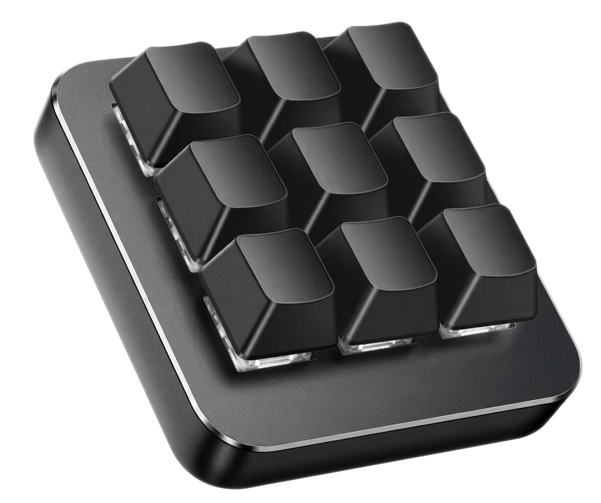

# Vaydeer Macro Keyboard Flasher




## Features

* Flash key configurations and custom firmware to Vaydeer macro keypads
* No need for stock software
* Native keyboard/media/mouse-style actions run on the keypad itself, so no background service is needed for normal use

This repository also documents the vendor protocol and firmware format. It includes
a firmware patch workflow for enabling native `F13`-`F24` keys, which the stock
9-key firmware does not expose.

Further details:

- [`DEVNOTES.md`](DEVNOTES.md): vendor app protocol and behavior notes
- [`FIRMWARE.md`](FIRMWARE.md): firmware format, update transport, and patch details
- [`SUPPORTED_KEYS.md`](SUPPORTED_KEYS.md): YAML key names and key codes

## Setup

Install `uv` from <https://docs.astral.sh/uv/getting-started/installation/>.
Then create the project environment:

```powershell
uv sync --extra dev
```

## Config Flashing

Inspect the connected keypad:

```powershell
uv run vaydeer-flash inspect
```

Flash a YAML key configuration:

```powershell
uv run vaydeer-flash flash examples/9key-basic.yaml
```

The tool supports the known Vaydeer 1-, 4-, 6-, and 9-key layouts. It validates
that the connected device key count matches the YAML `key_count` before writing.

Example config:

```yaml
key_count: 9
layer:
  name: Basic
  keys:
    1: A
    2: B
    3: C
    4: F1
    5: F2
    6: F3
    7: ENTER
    8: ESC
    9: SPACE
```

## Firmware Flashing

Factory firmware metadata is published by Vaydeer at:

```text
https://downloads.vaydeer.com/keyboard/firmware.json
```

For the 9-key keypad, the stock firmware currently resolves to:

```text
https://downloads.vaydeer.com/keyboard/drBoard-custom-UG-v1_1_2.bin
```

Download the stock 9-key firmware:

```powershell
Invoke-WebRequest -Uri "https://downloads.vaydeer.com/keyboard/drBoard-custom-UG-v1_1_2.bin" -OutFile "firmware/drBoard-custom-UG-v1_1_2.bin"
```

Dry-run a firmware flash:

```powershell
uv run vaydeer-flash flash-firmware --dry-run firmware/drBoard-custom-UG-v1_1_2.bin
```

Flash firmware:

```powershell
uv run vaydeer-flash flash-firmware --yes firmware/drBoard-custom-UG-v1_1_2.bin
```

After flashing firmware, unplug and reconnect the keypad before inspecting or
flashing key assignments.

## F13-F24 Firmware Patch

The stock 9-key firmware maps `F1`-`F12` but leaves `F13`-`F24` unmapped. This
project can patch the stock firmware so `F13`-`F24` become native hardware-emitted
keys while keeping stock `F1`-`F12` intact.

Create the patched firmware:

```powershell
uv run vaydeer-flash patch-firmware-f13 firmware/drBoard-custom-UG-v1_1_2.bin firmware/drBoard-custom-UG-v1_1_2-f13-f24.bin
```

Flash the patched firmware:

```powershell
uv run vaydeer-flash flash-firmware --yes firmware/drBoard-custom-UG-v1_1_2-f13-f24.bin
```

Then flash a config that uses the new keys:

```powershell
uv run vaydeer-flash flash 9key-f1-f3-f13-f18.yaml
```

See [`FIRMWARE.md`](FIRMWARE.md) for the firmware patch mechanics.

## Firmware Decode / Encode

The CLI can decode and re-encode Vaydeer firmware files. This is useful for
research and for building custom patches.

Decode a vendor `.bin` to a raw Cortex-M payload:

```powershell
uv run vaydeer-flash decode-firmware firmware/drBoard-custom-UG-v1_1_2.bin
```

Encode a decoded payload back into Vaydeer `.bin` format:

```powershell
uv run vaydeer-flash encode-firmware patched.decoded patched.bin --base-header firmware/drBoard-custom-UG-v1_1_2.bin
```

The encoder computes the firmware CRC, derives the payload XOR key, updates the
header, and writes a flashable vendor-format file.

## Key Tester

Open a small focused-window key tester:

```powershell
uv run vaydeer-key-test
```

For a window without a console, use the virtual environment's `pythonw.exe`:

```powershell
.\.venv\Scripts\pythonw.exe -m vaydeer_keypad.key_tester
```

The tester shows Tk key symbols, key codes, character data, and modifier state for
each press/release while the tester window is focused.
